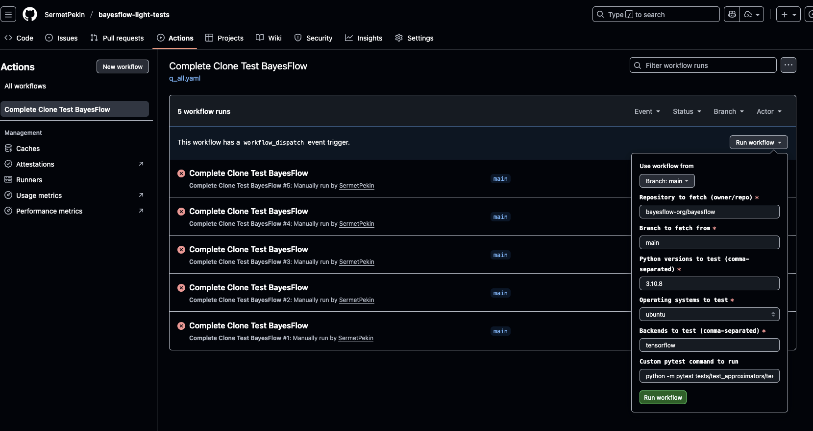

## Bayesflow light tests

```
  DEFAULT_PYTEST_CMD: 'python -m pytest bayesflow/tests/test_approximators/test_approximator_standardization/test_approximator_standardization.py'


```

## reproduction of the error (python 3.10.8)
```plaintext  

python 3.10.8
Failures 
ubuntu 
https://github.com/SermetPekin/bayesflow-light-tests/actions/runs/18851109612/job/53787677842

Mac 
https://github.com/SermetPekin/bayesflow-light-tests/actions/runs/18851262436/job/53788192073

Windows 
https://github.com/SermetPekin/bayesflow-light-tests/actions/runs/18851335808/job/53788438944

```

